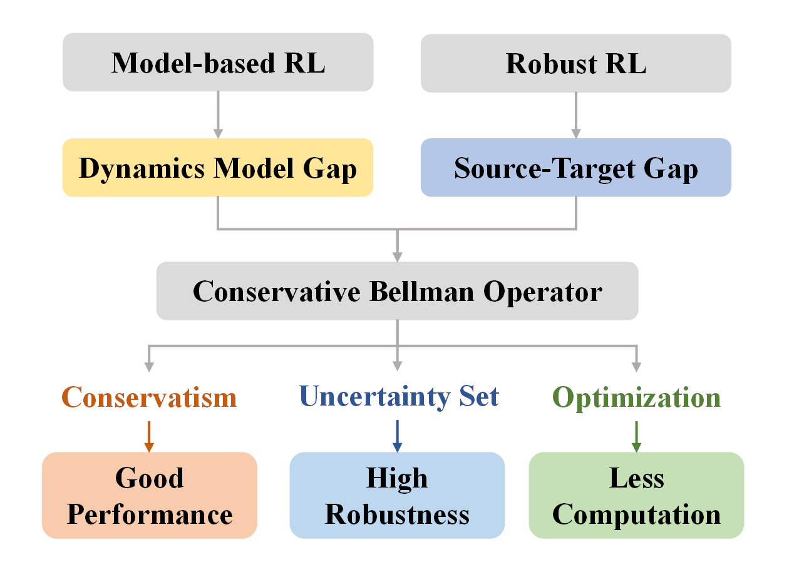

# MICRO: Model-Based Offline Reinforcement Learning with a Conservative Bellman Operator

[]

Code for MICRO: [Model-Based Offline Reinforcement Learning with a Conservative Bellman Operator](https://arxiv.org/abs/2312.03991). 
This method trades off performance and robustness via introducing the robust Bellman operator, 
and reduces the computation cost by only choosing the minimal Q value in the state uncertainty set. The implementation is based on [RORL](https://github.com/yangrui2015/rorl), [MOBILE](https://github.com/yihaosun1124/mobile) and [H2O](https://github.com/t6-thu/H2O).

<div style="text-align: center;">

</div>

## Installation

To install all the required dependencies:

1. Install the MuJoCo 2.1.0 engine, which can be downloaded from [MuJoCo 2.1.0](https://mujoco.org/).
2. Install Python packages listed in `MICRO.yml`.
   ```
   conda env create -f MICRO.yml
   conda activate MICRO
   ```
   
## Usage

### 1. Training

Just run `train.py` with specifying the task name. The hyperparameters are automatically loaded from `config`.

```bash
python train.py --task [task name]
```
'task name': e.g., walker2d-medium-expert-v2
### 2. Evaluation

Run `eval.py` to test the robustness of policy.

#### To test the effect of environment parameter perturbations, run
```bash
python eval.py --task [task name] --choice sim2real --policy_path [model path]
```
'model path': e.g., ~/model/policy.pth
#### To test the effect of external adversarial attacks, run

```bash
python eval.py --task [task name] --choice attack --attack_mode [attack type] --policy_path [model path]
```

'attack type': 'random, action_diff, min_Q'.


## Citation
If you find MICRO helpful for your work, please cite:
```
@article{liu2023micro,
  title={MICRO: Model-Based Offline Reinforcement Learning with a Conservative Bellman Operator},
  author={Liu, Xiao-Yin and Zhou, Xiao-Hu and Li, Guo-Tao and Li, Hao and Gui, Mei-Jiang and Xiang, Tian-Yu and Huang, De-Xing and Hou, Zeng-Guang},
  journal={arXiv preprint arXiv:2312.03991},
  year={2023}
}
```